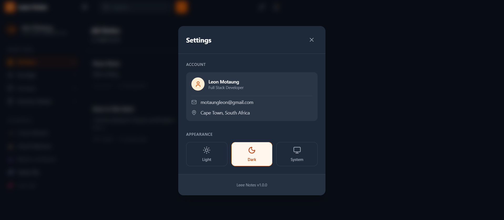
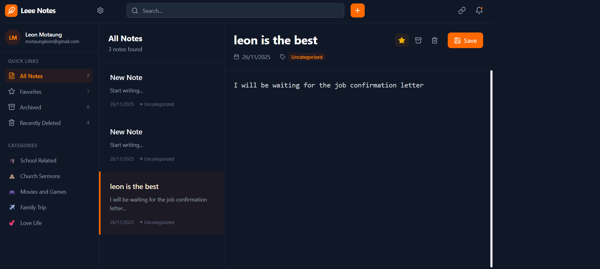

# Leee Notes

**Created by Leon Motaung**



Leee Notes is a modern, responsive note-taking application built with the MERN stack (MongoDB, Express, React, Node.js) and Vite. It offers a seamless experience for organizing your thoughts, tasks, and memories.

## ✨ Features



-   **Create, Read, Update, Delete (CRUD)**: Full control over your notes.
-   **Rich Text Editing**: Write notes with a clean and intuitive interface.
-   **Categorization**: Organize notes into categories like:
    -   🎓 School Related
    -   ⛪ Church Sermons
    -   🎮 Movies and Games
    -   ✈️ Family Trip
    -   💕 Love Life
-   **Search**: Instantly find notes by title, content, or category.
-   **Theme Customization**: Switch between **Light**, **Dark**, and **System** modes for a comfortable viewing experience.
-   **Responsive Design**: Works perfectly on desktop and mobile devices.
-   **Favorites & Archiving**: Mark important notes as favorites or archive old ones to keep your workspace clutter-free.
-   **Trash Management**: Soft delete notes to the trash with the option to permanently delete or restore them.

## 🚀 How to Run

### Prerequisites

-   [Node.js](https://nodejs.org/) installed on your machine.
-   [MongoDB](https://www.mongodb.com/) installed and running locally, or a MongoDB Atlas connection string.

### Installation

1.  Clone the repository.
2.  Install dependencies for the root, backend, and frontend:
    ```bash
    npm run install-all
    ```
    *Alternatively, you can install them individually:*
    ```bash
    npm install
    cd backend && npm install
    cd ../frontend && npm install
    ```

### Configuration

1.  Navigate to the `backend` directory.
2.  Create a `.env` file (you can copy `.env.example` if it exists).
3.  Add your MongoDB connection string (default is local) and Port:
    ```env
    PORT=5000
    MONGODB_URI=mongodb://localhost:27017/mern-app
    ```

### Running the App

From the root directory, run the following command to start both the backend server and the frontend development server concurrently:

```bash
npm run dev
```

-   **Frontend**: Accessible at `http://localhost:5173` (or your network IP).
-   **Backend**: Running on `http://localhost:5000`.

## 🛠️ Tech Stack

-   **Frontend**: React, TypeScript, Tailwind CSS, Lucide React, Vite.
-   **Backend**: Node.js, Express.js.
-   **Database**: MongoDB, Mongoose.